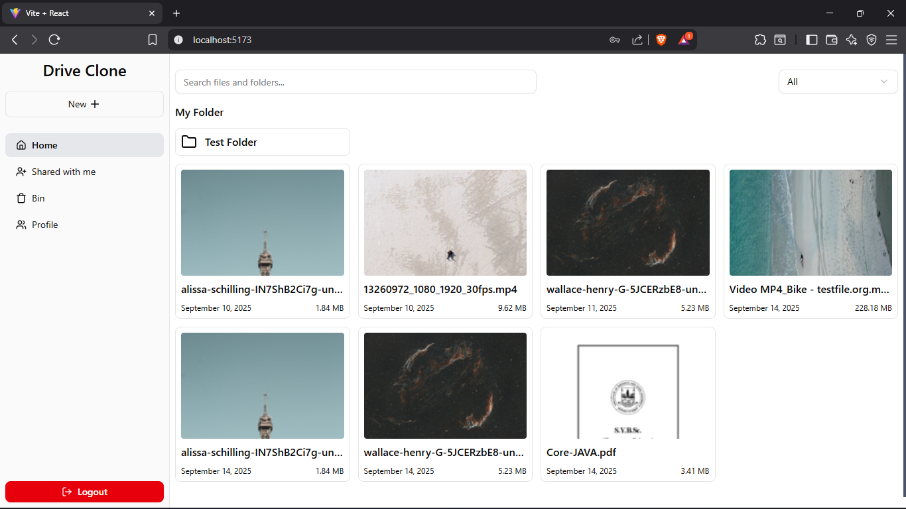

# 🚀 Google Drive Clone (MERN + AWS S3)

A full-stack cloud storage application built with **MERN stack** and **AWS S3**, inspired by Google Drive.  
This project focuses on implementing **industry-standard practices** like presigned URL uploads, thumbnail generation, file previews, sharing, **and ZIP downloads**.

---

## ✨ Features Implemented

### 📂 File & Folder Management
- Create files with name and upload using **AWS S3 presigned URLs**.
- Create folders and upload files inside them.
- Support for **nested folders** and files (hierarchical structure).
- Move and copy files/folders using **drag & drop** or action buttons.
- Trash bin: **Move to Trash, Restore, Delete Permanently**.
- **Download single/multiple files or entire folders as a ZIP archive.**

### 🖼️ Preview & Thumbnails
- Preview files directly in the app:
  - Images (viewable inline)
  - Videos (playable in-app)
  - PDF & Docs (open in iframe)
- Generate **thumbnails** for:
  - Images
  - Videos
  - PDFs
  - Word documents

### 🔍 Search & Filters
- Search by **file name** and **file type**.

### 🤝 Sharing
- Share files and folders with others via **email**.
- Shared items appear in a dedicated **Shared section**.
- File details include:
  - Shared with info
  - File size
  - File type
  - Folder location

### ⚡ User Experience
- Upload queue system with progress tracking.
- File upload status: pending → uploading → processing → success/error.
- Real-time progress updates with toast notifications.
- **Download file and folders as ZIP files.**

---

## 🛠️ Tech Stack

- **Frontend**: React (Vite), Redux, TailwindCSS, ShadCN/UI  
- **Backend**: Node.js, Express  
- **Database**: MongoDB  
- **Storage**: AWS S3 (presigned URL uploads + ZIP downloads)  
- **Other**: React Query, Axios, Lucide Icons, Toast Notifications  

---

## 📸 Screenshots

### Dashboard


### Folder Navigation


### File Details


### Preview Files


### Search Files


### Shared With Me


### Update Access


### Deleted Files (Bin)


### Update Password


---

## ⚡ How to Run Locally

```bash
# Clone repo
git clone https://github.com/Ketan-Mane/G_Drive_Clone.git
cd G_Drive_Clone

# -------------------------------
# Backend Setup (Dockerized)
# -------------------------------
# Make sure Docker & Docker Compose are installed

# Setup environment variables
# (create a `.env` file inside ./backend with values like:)
# MONGODB_URI=your_mongodb_uri
# AWS_ACCESS_KEY_ID=your_access_key
# AWS_SECRET_ACCESS_KEY=your_secret_key
# AWS_BUCKET_NAME=your_bucket_name

# Build and run backend with Docker
docker-compose up --build api

# Backend will now be running on:
# 👉 http://localhost:8000

# -------------------------------
# Frontend Setup (Local)
# -------------------------------
cd frontend
npm install

# Setup environment variables
# (e.g., VITE_API_URL=http://localhost:8000)

# Run frontend
npm run dev
